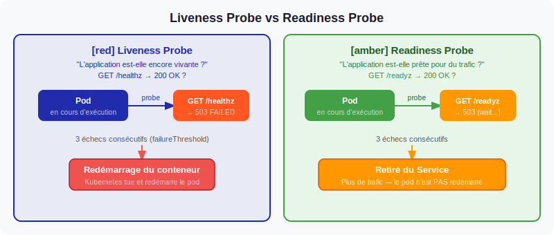
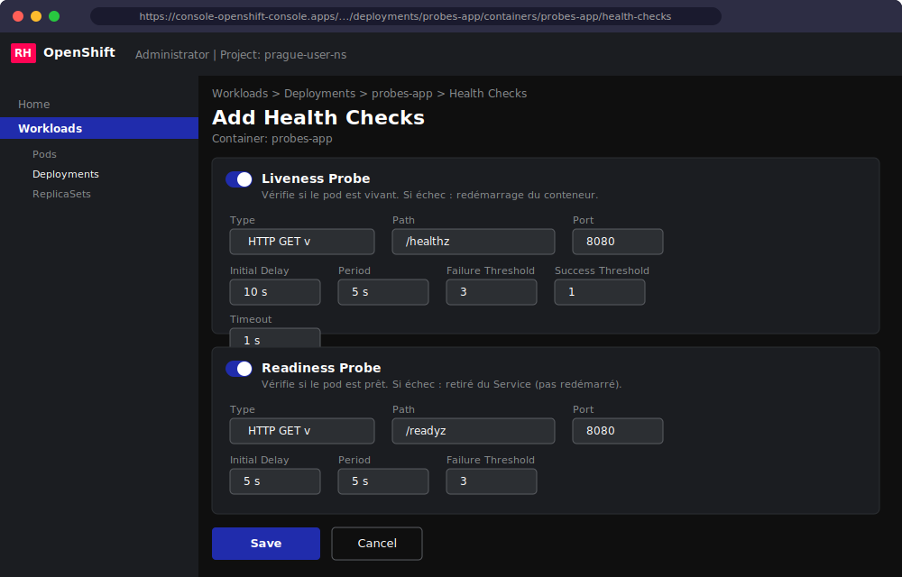

# Sondes d'intégrité des applications dans OpenShift

## Introduction

Dans un environnement de conteneurs orchestré par Kubernetes et OpenShift, les applications peuvent se retrouver dans des états défaillants sans pour autant que le processus principal ait planté. Une application peut être démarrée et en cours d'exécution tout en étant incapable de traiter des requêtes : fuite mémoire progressive, deadlock applicatif, dépendance externe indisponible, ou encore phase d'initialisation longue. Sans mécanisme de supervision, ces situations dégradent silencieusement le service.

Les **sondes d'intégrité** (ou *health probes*) sont des mécanismes natifs de Kubernetes permettant à l'orchestrateur d'évaluer régulièrement l'état de santé de chaque conteneur. Selon le résultat de ces vérifications, Kubernetes peut décider de redémarrer un pod, de l'exclure temporairement du trafic entrant, ou d'attendre qu'il soit pleinement opérationnel avant de le solliciter.

Cette page décrit les trois types de sondes disponibles, les méthodes de test associées, les paramètres de configuration, et les bonnes pratiques à adopter pour des applications robustes.

---

## Vue d'ensemble des trois types de sondes



*Diagramme illustrant le cycle de vie d'un pod et l'action de chaque type de sonde : la Startup probe protège le démarrage, la Liveness probe surveille l'exécution, la Readiness probe contrôle l'accessibilité au trafic.*

Le tableau suivant résume les trois types de sondes, leur comportement en cas d'échec et leurs cas d'usage typiques :

| Type de sonde | Description | Comportement en cas d'échec | Cas d'usage typique |
|---|---|---|---|
| **Liveness** | Vérifie que le conteneur est vivant et fonctionnel | Kubernetes **redémarre** le pod | Application bloquée, deadlock, fuite mémoire |
| **Readiness** | Vérifie que le conteneur est prêt à recevoir du trafic | Kubernetes **retire le pod du Service** (sans redémarrage) | Chargement initial de données, connexion à une BDD |
| **Startup** | Vérifie que le conteneur a bien démarré (phase initiale uniquement) | Kubernetes **redémarre** le pod si le délai est dépassé | Applications avec démarrage lent (JVM, migrations) |

### Sonde Liveness

La sonde Liveness répond à la question : "Ce conteneur est-il toujours en vie ?". Elle s'exécute tout au long du cycle de vie du pod à intervalles réguliers. Son objectif est de détecter les états d'exécution pathologiques qui ne provoquent pas l'arrêt du processus : une boucle infinie, un thread en deadlock, ou une accumulation mémoire qui rend le serveur inopérant.

Lorsque la sonde échoue un nombre de fois consécutives supérieur au seuil configuré (`failureThreshold`), Kubernetes met fin au conteneur et le redémarre selon la politique `restartPolicy` du pod (par défaut `Always`).

**Exemple — Liveness probe HTTP GET :**

```yaml
livenessProbe:
  httpGet:
    path: /healthz
    port: 8080
  initialDelaySeconds: 20
  periodSeconds: 10
  failureThreshold: 3
  timeoutSeconds: 5
```

### Sonde Readiness

La sonde Readiness répond à la question : "Ce conteneur est-il prêt à servir des requêtes ?". Elle contrôle si un pod doit être inclus dans les endpoints d'un Service. Un pod dont la sonde Readiness échoue reste en cours d'exécution mais est retiré de la rotation de charge : aucune nouvelle requête ne lui est envoyée jusqu'à ce que la sonde repasse à l'état réussi.

Ce mécanisme est indispensable pour les mises à jour progressives (*rolling updates*) : un nouveau pod n'est intégré au service qu'une fois déclaré prêt, garantissant ainsi une transition sans interruption.

**Exemple — Readiness probe HTTP GET :**

```yaml
readinessProbe:
  httpGet:
    path: /ready
    port: 8080
  initialDelaySeconds: 10
  periodSeconds: 5
  failureThreshold: 6
  successThreshold: 1
```

### Sonde Startup

La sonde Startup répond à la question : "Le conteneur a-t-il fini de démarrer ?". Elle ne s'exécute que pendant la phase de démarrage du pod. Tant qu'elle n'a pas réussi, les sondes Liveness et Readiness sont **désactivées**. Une fois qu'elle réussit, elle disparaît et laisse place aux deux autres.

:::info Protection du démarrage par la Startup probe
Sans sonde Startup, une application dont le démarrage prend 60 secondes sera immanquablement tuée par la sonde Liveness si celle-ci est configurée avec `initialDelaySeconds: 20` et `failureThreshold: 3`. La sonde Startup résout ce problème en accordant un délai généreux au démarrage (`failureThreshold * periodSeconds`) sans assouplir la surveillance en production. Par exemple, `failureThreshold: 30` + `periodSeconds: 10` accorde jusqu'à 5 minutes au démarrage, tout en maintenant une sonde Liveness stricte (10 secondes) une fois l'application opérationnelle.
:::

**Exemple — Startup probe pour une application JVM :**

```yaml
startupProbe:
  httpGet:
    path: /healthz
    port: 8080
  failureThreshold: 30
  periodSeconds: 10
```

---

## Méthodes de test disponibles

Kubernetes propose trois mécanismes pour effectuer les vérifications des sondes. Chaque méthode s'adapte à un type d'application différent :

| Méthode | Description | Critère de succès | Usage recommandé |
|---|---|---|---|
| **HTTP GET** | Envoie une requête HTTP(S) à un endpoint du conteneur | Code de réponse entre 200 et 399 | Applications web, APIs REST, microservices |
| **TCP Socket** | Tente d'établir une connexion TCP sur un port | Connexion établie avec succès | Bases de données, brokers de messages, services non-HTTP |
| **Exec Command** | Exécute une commande dans le conteneur | Code de retour 0 | Scripts de vérification personnalisés, outils CLI embarqués |

### HTTP GET

```yaml
livenessProbe:
  httpGet:
    path: /healthz
    port: 8080
    httpHeaders:
    - name: X-Health-Check
      value: "true"
```

### TCP Socket

```yaml
readinessProbe:
  tcpSocket:
    port: 5432
  initialDelaySeconds: 10
  periodSeconds: 5
```

### Exec Command

```yaml
livenessProbe:
  exec:
    command:
    - /bin/sh
    - -c
    - "pg_isready -U postgres"
  initialDelaySeconds: 30
  periodSeconds: 10
```

---

## Paramètres de configuration

Chaque sonde accepte un ensemble de paramètres permettant de régler finement son comportement. Ces paramètres sont communs aux trois types de sondes et aux trois méthodes de test :

| Paramètre | Type | Valeur par défaut | Description |
|---|---|---|---|
| `initialDelaySeconds` | int | 0 | Délai en secondes avant la première exécution de la sonde après le démarrage du conteneur |
| `periodSeconds` | int | 10 | Fréquence d'exécution de la sonde (en secondes) |
| `timeoutSeconds` | int | 1 | Délai maximum d'attente d'une réponse avant de considérer la sonde échouée |
| `successThreshold` | int | 1 | Nombre de succès consécutifs requis pour passer de l'état "failed" à "success" (minimum 1, toujours 1 pour Liveness et Startup) |
| `failureThreshold` | int | 3 | Nombre d'échecs consécutifs avant de déclencher l'action corrective (redémarrage ou retrait du service) |

:::tip Choisir des valeurs de timeout adaptées
Un `timeoutSeconds` trop court (1 seconde par défaut) est souvent insuffisant pour des endpoints qui effectuent des vérifications internes (connexion BDD, cache). Préférez des valeurs entre 3 et 5 secondes. En parallèle, un `periodSeconds` trop court augmente la charge sur l'application et le plan de contrôle Kubernetes : 10 à 30 secondes est une valeur raisonnable pour les sondes en régime de croisière.
:::

---

## Exemple complet avec les trois sondes

Voici un exemple de déploiement configurant les trois types de sondes simultanément pour une application web Java :

```yaml
apiVersion: apps/v1
kind: Deployment
metadata:
  name: welcome-app
  namespace: production
spec:
  replicas: 3
  selector:
    matchLabels:
      app: welcome-app
  template:
    metadata:
      labels:
        app: welcome-app
    spec:
      containers:
      - name: welcome-app
        image: quay.io/example/welcome-app:v2
        ports:
        - containerPort: 8080
        resources:
          requests:
            cpu: "250m"
            memory: "256Mi"
          limits:
            cpu: "500m"
            memory: "512Mi"
        startupProbe:
          httpGet:
            path: /healthz
            port: 8080
          failureThreshold: 30
          periodSeconds: 10
        livenessProbe:
          httpGet:
            path: /healthz
            port: 8080
          initialDelaySeconds: 0
          periodSeconds: 10
          timeoutSeconds: 5
          failureThreshold: 3
        readinessProbe:
          httpGet:
            path: /ready
            port: 8080
          initialDelaySeconds: 0
          periodSeconds: 5
          timeoutSeconds: 3
          failureThreshold: 6
          successThreshold: 1
```

:::warning Sondes trop strictes et redémarrages en cascade
Des sondes Liveness excessivement sensibles peuvent provoquer des redémarrages en cascade. Si un pod connaît un pic de charge temporaire qui ralentit son endpoint `/healthz`, la sonde peut l'éliminer, ce qui augmente la charge sur les pods restants, qui à leur tour deviennent lents, sont éliminés, et ainsi de suite. Pour éviter ce phénomène :
- Assurez-vous que l'endpoint de santé est **léger et indépendant de la charge applicative**.
- Augmentez `failureThreshold` et `timeoutSeconds` plutôt que de descendre `periodSeconds`.
- Utilisez des endpoints `/healthz` (liveness) et `/ready` (readiness) **distincts** avec des logiques différentes.
:::

---

## Configuration depuis la console OpenShift

Il est possible de configurer les sondes directement depuis l'interface web d'OpenShift, sans éditer de YAML manuellement.



*Vue du formulaire "Health Checks" dans la console OpenShift : sélection du type de sonde, de la méthode de test et des paramètres de délai.*

Pour accéder à cette interface :

1. Naviguer vers **Workloads > Deployments**
2. Sélectionner le déploiement concerné
3. Cliquer sur l'onglet **Actions > Edit health checks** (ou accéder directement à l'onglet **Health checks** du déploiement)
4. Configurer les sondes Liveness, Readiness et Startup avec les paramètres souhaités

## Configuration par ligne de commande

La commande `oc set probe` permet d'ajouter ou de modifier une sonde directement depuis le terminal :

```bash
# Ajouter une sonde Readiness HTTP
oc set probe deployment/welcome-app \
  --readiness \
  --get-url http://:8080/ready \
  --failure-threshold 6 \
  --period-seconds 5

# Ajouter une sonde Liveness TCP
oc set probe deployment/redis \
  --liveness \
  --open-tcp 6379 \
  --initial-delay-seconds 15 \
  --period-seconds 10

# Supprimer une sonde
oc set probe deployment/welcome-app --remove --readiness
```

---

## Résumé et bonnes pratiques

Les sondes d'intégrité sont un mécanisme fondamental pour garantir la fiabilité des applications dans OpenShift. Voici les points essentiels à retenir :

- **Toujours définir une Readiness probe** sur les pods qui servent du trafic, pour éviter d'envoyer des requêtes à un pod non prêt lors des démarrages ou des rolling updates.
- **Utiliser une Startup probe** pour les applications dont le démarrage dépasse 30 secondes, afin de ne pas lutter contre la Liveness probe pendant l'initialisation.
- **Garder l'endpoint de Liveness probe léger** : il doit retourner une réponse en quelques millisecondes, sans interroger des dépendances externes.
- **Distinguer les endpoints `/healthz` et `/ready`** : le premier vérifie que le processus est vivant, le second vérifie que toutes les dépendances nécessaires au traitement des requêtes sont disponibles.
- **Tester les sondes localement** avant de déployer en production, en simulant des états de défaillance.
